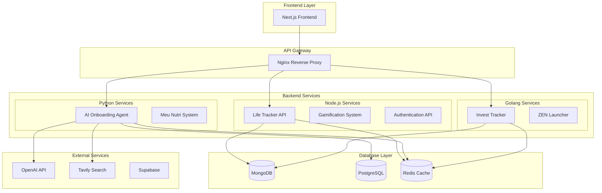

# 🚀 Systentando Backend Monorepo

> **Ecossistema completo de desenvolvimento profissional, bem-estar pessoal e empreendedorismo**

[](https://opensource.org/licenses/MIT)
[](https://nodejs.org/)
[](https://python.org/)
[](https://golang.org/)
[](https://docker.com/)

## 📋 Visão Geral

O **Systentando Backend Monorepo** é uma arquitetura multi-linguagem que combina as melhores tecnologias para criar um ecossistema robusto de desenvolvimento profissional, bem-estar pessoal e empreendedorismo. Construído seguindo os princípios **SOLID** e **Clean Architecture**, oferece uma base sólida para produtos modulares que se integram perfeitamente.

### 🎯 **Proposta de Valor**
> *"Conexões que Transformam"* - Conectamos desenvolvedores a oportunidades de negócio, bem-estar pessoal a produtividade, e contribuições individuais a recompensas tangíveis através de um modelo de equity comunitária.

## 🏗️ Arquitetura Multi-Linguagem

### **Node.js (NestJS + MongoDB)**
- **Domínio**: APIs RESTful, Life Tracker, Gamificação
- **Tecnologias**: NestJS 10, TypeScript 5, MongoDB, JWT
- **Porta**: 3000-3001
- **Responsabilidades**: 
  - Life Tracker API (analytics, business, financial, gamification)
  - Sistema de Gamificação (pontos, conquistas, progresso)
  - API Gateway centralizado
  - Autenticação e autorização

### **Python (FastAPI + PostgreSQL)**
- **Domínio**: IA, Onboarding, Nutrição
- **Tecnologias**: FastAPI, Agno Framework, OpenAI, PostgreSQL
- **Porta**: 8000
- **Responsabilidades**:
  - Agente de Onboarding com IA personalizada
  - Sistema de Nutrição (Meu Nutri)
  - Processamento de linguagem natural
  - Memória persistente de usuários

### **Golang (Gin + MongoDB)**
- **Domínio**: Performance, Investimentos, Bem-estar
- **Tecnologias**: Gin, Clean Architecture, MongoDB
- **Porta**: 8080-8083
- **Responsabilidades**:
  - Invest Tracker (análise financeira)
  - ZEN Launcher (bem-estar digital)
  - Coleta de dados em tempo real
  - Simulação de portfólios

## 🚀 Quick Start

### **Pré-requisitos**
```bash
# Docker e Docker Compose
docker --version
docker-compose --version

# Node.js 18+
node --version

# Python 3.11+
python --version

# Go 1.21+
go version
```

### **Instalação e Execução**

#### **Opção 1: Docker Compose (Recomendado)**
```bash
# Clone o repositório
git clone https://github.com/systentandobr/backend-monorepo.git
cd backend-monorepo

# Iniciar todos os serviços
docker-compose up -d

# Verificar status
docker-compose ps

# Ver logs
docker-compose logs -f
```

#### **Opção 2: Desenvolvimento Local**
```bash
# Node.js APIs
cd nodejs/apis
npm install
npm run start:dev

# Python Services
cd python/life-tracker/agent-onboarding
pip install -r requirements.txt
python -m uvicorn main:app --reload

# Golang Services
cd golang/invest-tracker
go mod tidy
go run cmd/main.go
```

## 📊 Diagrama de Arquitetura



## 🛠️ Tecnologias e Domínios

### **Node.js Ecosystem**
```typescript
// Life Tracker API - Módulos implementados
├── analytics/          # Métricas e análises
├── business/          # Oportunidades de negócio
├── financial/         # Dados financeiros
├── gamification/      # Sistema de gamificação
├── habits/           # Gerenciamento de hábitos
├── health/           # Dados de saúde
├── productivity/     # Metas de produtividade
└── routines/         # Rotinas integradas
```

### **Python Ecosystem**
```python
# Agno Framework - IA Personalizada
├── core/             # Core do agente IA
├── tools/            # Ferramentas especializadas
├── memory/           # Memória PostgreSQL
└── api/              # Endpoints FastAPI

# Meu Nutri - Sistema de Nutrição
├── nutrition/        # Análise nutricional
├── recommendations/  # Recomendações IA
└── tracking/         # Acompanhamento
```

### **Golang Ecosystem**
```go
// Clean Architecture - Invest Tracker
├── internal/
│   ├── domain/       # Entidades de domínio
│   ├── usecase/      # Casos de uso
│   ├── repository/    # Repositórios
│   └── handler/       # Handlers HTTP
├── pkg/              # Pacotes compartilhados
└── cmd/              # Aplicações
```

## 🔐 Sistema de Gamificação

### **Elementos Implementados**
- **Pontos de Contribuição (CP)**: Recompensas por atividades
- **Pontos de Experiência (XP)**: Progressão de nível
- **Tokens de Equity (ET)**: Participação no sucesso
- **Conquistas**: Distintivos por habilidades
- **Desafios**: Missões com objetivos específicos

### **Níveis de Progressão**
```
Nível 1: Iniciante (0-100 XP)
Nível 2: Aprendiz (101-300 XP)
Nível 3: Praticante (301-600 XP)
Nível 4: Especialista (601-1000 XP)
Nível 5: Mestre (1001-1500 XP)
Nível 6: Visionário (1501-2100 XP)
Nível 7: Pioneiro (2101-2800 XP)
Nível 8: Inovador (2801-3600 XP)
Nível 9: Virtuoso (3601-4500 XP)
Nível 10: Lenda (4501+ XP)
```

## 🌐 APIs e Endpoints

### **Life Tracker API (Node.js)**
```bash
# Analytics
GET    /api/analytics/metrics
GET    /api/analytics/trends

# Business
GET    /api/business/opportunities
POST   /api/business/projects

# Financial
GET    /api/financial/portfolio
POST   /api/financial/transactions

# Gamification
GET    /api/gamification/points
GET    /api/gamification/achievements
POST   /api/gamification/claim-reward

# Health & Habits
GET    /api/health/progress
POST   /api/habits
GET    /api/productivity/goals
```

### **AI Onboarding Agent (Python)**
```bash
# Onboarding
POST   /onboarding/complete
POST   /onboarding/analyze-profile
POST   /onboarding/generate-plan

# Memory & Recommendations
GET    /onboarding/user/{id}/memory
GET    /onboarding/user/{id}/recommendations
POST   /onboarding/user/{id}/feedback
```

### **Invest Tracker (Golang)**
```bash
# Assets & Portfolio
GET    /api/assets
POST   /api/portfolio/simulate
GET    /api/opportunities

# Alerts & Notifications
POST   /api/alerts
GET    /api/notifications
```

## 🗄️ Bancos de Dados

### **MongoDB (Node.js + Golang)**
- **Dados Não-Relacionais**: Métricas, logs, cache
- **Schemas Flexíveis**: Estruturas adaptáveis
- **Performance**: Consultas otimizadas
- **Escalabilidade**: Sharding automático

### **PostgreSQL (Python)**
- **Dados Relacionais**: Usuários, sessões, memória
- **ACID**: Transações consistentes
- **Índices**: Performance otimizada
- **Backup**: Replicação automática

### **Redis (Cache)**
- **Cache Distribuído**: Performance otimizada
- **Sessões**: Gerenciamento de estado
- **Rate Limiting**: Proteção contra abusos

## 📈 Monitoramento e Observabilidade

### **Health Checks**
```bash
# Verificar saúde dos serviços
curl http://localhost:3000/health  # Node.js
curl http://localhost:8000/health  # Python
curl http://localhost:8080/health  # Golang
```

### **Ferramentas de Monitoramento**
| Ferramenta | URL | Descrição |
|------------|-----|-----------|
| **Prometheus** | http://localhost:9090 | Coleta de métricas |
| **Grafana** | http://localhost:3001 | Visualização de dados |
| **PgAdmin** | http://localhost:5050 | Admin PostgreSQL |
| **Mongo Express** | http://localhost:8081 | Admin MongoDB |
| **Redis Commander** | http://localhost:8082 | Admin Redis |

## 🚀 Deploy e Produção

### **Railway Multi-Service**
```bash
# Deploy automatizado
chmod +x deploy-multi-service.sh
./deploy-multi-service.sh

# Deploy individual
./deploy-multi-service.sh --nodejs-only
./deploy-multi-service.sh --python-only
./deploy-multi-service.sh --golang-only
```

### **Docker Multi-Stage Build**
```dockerfile
# Otimização de tamanho e segurança
FROM node:18-alpine AS node-builder
FROM python:3.11-alpine AS python-builder
FROM golang:1.21-alpine AS go-builder
FROM alpine:latest AS runtime
```

## 🔧 Comandos Úteis

### **Desenvolvimento**
```bash
# Iniciar ambiente de desenvolvimento
make dev

# Build e deploy
make build
make deploy

# Testes
make test
make test-nodejs
make test-python
make test-golang

# Linting
make lint
make lint-nodejs
make lint-python
make lint-golang
```

### **Monitoramento**
```bash
# Ver logs
make logs
make logs-backend
make logs-db

# Status dos serviços
make status

# Shell dos containers
make shell
make shell-postgres
make shell-mongodb
```

## 📚 Documentação Adicional

- [📖 Documentação Completa](./docs/index.md)
- [🏗️ Arquitetura Detalhada](./docs/architecture/backend-monorepo-architecture.md)
- [🚀 Guia de Deploy](./README-DEPLOY.md)
- [🔧 Multi-Service Setup](./README-MULTI-SERVICE.md)
- [📊 Resumo Executivo](./docs/executive-summary.md)

## 🤝 Contribuição

### **Como Contribuir**
1. Fork o projeto
2. Crie uma branch para sua feature (`git checkout -b feature/AmazingFeature`)
3. Commit suas mudanças (`git commit -m 'Add some AmazingFeature'`)
4. Push para a branch (`git push origin feature/AmazingFeature`)
5. Abra um Pull Request

### **Padrões de Código**
- **Node.js**: ESLint + Prettier
- **Python**: Black + isort + flake8
- **Golang**: gofmt + golint
- **Testes**: Cobertura mínima 80%
- **Documentação**: JSDoc, docstrings, godoc

## 📞 Suporte

- **Documentação**: [docs/index.md](./docs/index.md)
- **Issues**: [GitHub Issues](https://github.com/systentandobr/backend-monorepo/issues)
- **Discord**: [Comunidade Systentando](https://discord.gg/systentando)
- **Email**: contato@systentando.com

## 📄 Licença

Este projeto está licenciado sob a Licença MIT - veja o arquivo [LICENSE](LICENSE) para detalhes.

---

**Desenvolvido com ❤️ seguindo os princípios SOLID e Clean Architecture**

*Transformando desenvolvedores em empreendedores e equilibrando sucesso profissional com bem-estar pessoal.*
