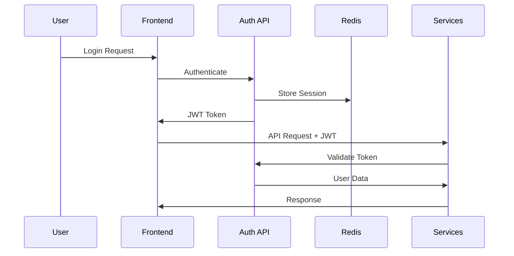
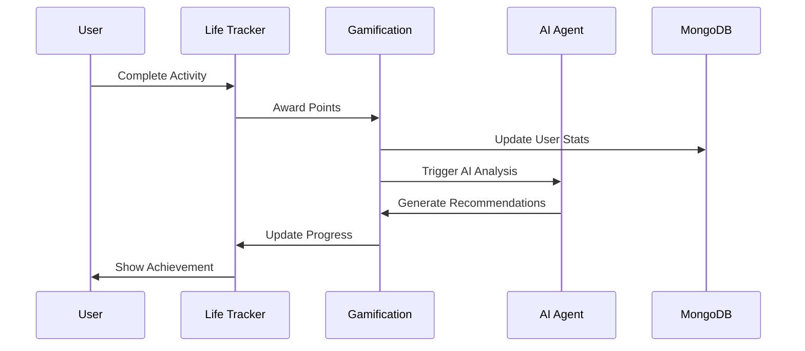
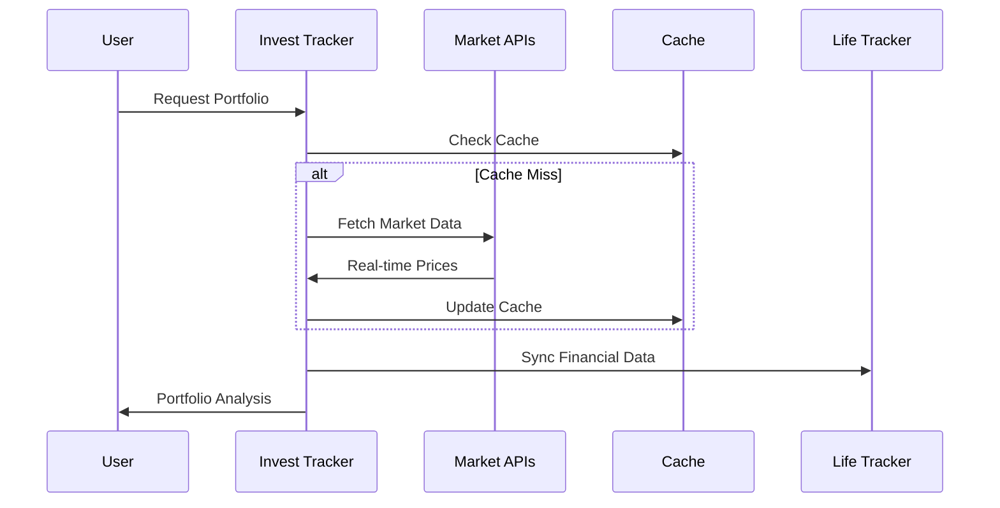

# Diagrama de Integração - Systentando Backend Monorepo

## Visão Geral da Arquitetura

Este diagrama mostra como as diferentes tecnologias (Node.js, Python, Golang) se integram no ecossistema Systentando, compartilhando dados e funcionalidades através de APIs RESTful e sistemas de cache distribuído.

## Diagrama de Integração

```mermaid
graph TB
    subgraph "Frontend Layer"
        FE[Next.js Frontend<br/>React 19 + TypeScript]
        MOBILE[Mobile Apps<br/>React Native]
    end
    
    subgraph "API Gateway Layer"
        NGINX[Nginx Reverse Proxy<br/>Load Balancer]
        CORS[CORS Middleware<br/>Security Headers]
    end
    
    subgraph "Authentication Layer"
        AUTH[SYS-SEGURANÇA API<br/>Centralized Auth]
        JWT[JWT Tokens<br/>RBAC]
        REDIS_AUTH[Redis Auth Cache<br/>Session Management]
    end
    
    subgraph "Node.js Ecosystem"
        subgraph "Life Tracker API"
            LT_ANALYTICS[Analytics Module<br/>Metrics & Trends]
            LT_BUSINESS[Business Module<br/>Opportunities]
            LT_FINANCIAL[Financial Module<br/>Portfolio Data]
            LT_GAMIFICATION[Gamification Module<br/>Points & Achievements]
            LT_HABITS[Habits Module<br/>Habit Tracking]
            LT_HEALTH[Health Module<br/>Wellness Data]
            LT_PRODUCTIVITY[Productivity Module<br/>Goals & Tasks]
            LT_ROUTINES[Routines Module<br/>Integrated Routines]
        end
        
        subgraph "Additional APIs"
            ASSISTENTE[Assistente Estudos<br/>AI Study Assistant]
            PAGAMENTOS[Pagamentos API<br/>Payment System]
            PRODUTOS[Produtos API<br/>Product Catalog]
        end
    end
    
    subgraph "Python Ecosystem"
        subgraph "AI Onboarding Agent"
            AGNO_CORE[Agno Framework Core<br/>AI Agent Engine]
            AGNO_TOOLS[Specialized Tools<br/>7 AI Tools]
            AGNO_MEMORY[Memory System<br/>PostgreSQL]
            AGNO_API[FastAPI Endpoints<br/>AI Interactions]
        end
        
        subgraph "Meu Nutri System"
            NUTRI_AI[Nutrition AI<br/>Food Analysis]
            NUTRI_REC[Recommendations<br/>Personalized Advice]
            NUTRI_TRACK[Meal Tracking<br/>Nutrition Data]
        end
    end
    
    subgraph "Golang Ecosystem"
        subgraph "Invest Tracker"
            INVEST_ASSETS[Asset Management<br/>Real-time Data]
            INVEST_PORTFOLIO[Portfolio Analysis<br/>Risk Assessment]
            INVEST_ALERTS[Alert System<br/>Notifications]
            INVEST_SIM[Simulation Engine<br/>Portfolio Testing]
        end
        
        subgraph "ZEN Launcher"
            ZEN_SCREEN[Screen Time<br/>Digital Wellness]
            ZEN_FOCUS[Focus Sessions<br/>Productivity]
            ZEN_ACHIEVEMENTS[Wellness Achievements<br/>Gamification]
        end
        
        subgraph "Additional Services"
            CATALOG[Catalog Structure<br/>Product Organization]
            BUSINESS[Business System<br/>Opportunity Matching]
        end
    end
    
    subgraph "Database Layer"
        MONGO[(MongoDB<br/>NoSQL Database<br/>Node.js + Golang)]
        POSTGRES[(PostgreSQL<br/>Relational Database<br/>Python)]
        REDIS[(Redis<br/>Cache & Sessions<br/>All Services)]
    end
    
    subgraph "External Services"
        OPENAI[OpenAI API<br/>GPT-4 + Embeddings]
        TAVILY[Tavily Search<br/>Web Intelligence]
        SUPABASE[Supabase<br/>Backend Services]
        ALPHA_VANTAGE[Alpha Vantage<br/>Financial Data]
        FINNHUB[Finnhub API<br/>Market Data]
    end
    
    subgraph "Monitoring & Observability"
        PROMETHEUS[Prometheus<br/>Metrics Collection]
        GRAFANA[Grafana<br/>Data Visualization]
        LOGS[Structured Logs<br/>JSON Format]
        HEALTH[Health Checks<br/>Service Status]
    end
    
    %% Frontend Connections
    FE --> NGINX
    MOBILE --> NGINX
    
    %% API Gateway Connections
    NGINX --> CORS
    CORS --> AUTH
    CORS --> LT_ANALYTICS
    CORS --> AGNO_API
    CORS --> INVEST_ASSETS
    
    %% Authentication Flow
    AUTH --> JWT
    AUTH --> REDIS_AUTH
    JWT --> LT_ANALYTICS
    JWT --> AGNO_API
    JWT --> INVEST_ASSETS
    
    %% Node.js Internal Connections
    LT_ANALYTICS --> LT_BUSINESS
    LT_BUSINESS --> LT_FINANCIAL
    LT_FINANCIAL --> LT_GAMIFICATION
    LT_GAMIFICATION --> LT_HABITS
    LT_HABITS --> LT_HEALTH
    LT_HEALTH --> LT_PRODUCTIVITY
    LT_PRODUCTIVITY --> LT_ROUTINES
    
    %% Python Internal Connections
    AGNO_CORE --> AGNO_TOOLS
    AGNO_TOOLS --> AGNO_MEMORY
    AGNO_MEMORY --> AGNO_API
    NUTRI_AI --> NUTRI_REC
    NUTRI_REC --> NUTRI_TRACK
    
    %% Golang Internal Connections
    INVEST_ASSETS --> INVEST_PORTFOLIO
    INVEST_PORTFOLIO --> INVEST_ALERTS
    INVEST_ALERTS --> INVEST_SIM
    ZEN_SCREEN --> ZEN_FOCUS
    ZEN_FOCUS --> ZEN_ACHIEVEMENTS
    
    %% Database Connections
    LT_ANALYTICS --> MONGO
    LT_GAMIFICATION --> MONGO
    INVEST_ASSETS --> MONGO
    ZEN_SCREEN --> MONGO
    AGNO_MEMORY --> POSTGRES
    NUTRI_TRACK --> POSTGRES
    AUTH --> REDIS
    LT_ANALYTICS --> REDIS
    AGNO_CORE --> REDIS
    INVEST_ASSETS --> REDIS
    
    %% External API Connections
    AGNO_CORE --> OPENAI
    AGNO_TOOLS --> TAVILY
    NUTRI_AI --> OPENAI
    INVEST_ASSETS --> ALPHA_VANTAGE
    INVEST_ASSETS --> FINNHUB
    LT_FINANCIAL --> SUPABASE
    
    %% Monitoring Connections
    LT_ANALYTICS --> PROMETHEUS
    AGNO_API --> PROMETHEUS
    INVEST_ASSETS --> PROMETHEUS
    PROMETHEUS --> GRAFANA
    LT_ANALYTICS --> LOGS
    AGNO_CORE --> LOGS
    INVEST_ASSETS --> LOGS
    LT_ANALYTICS --> HEALTH
    AGNO_API --> HEALTH
    INVEST_ASSETS --> HEALTH
    
    %% Cross-Service Communication
    LT_GAMIFICATION -.-> AGNO_TOOLS
    LT_FINANCIAL -.-> INVEST_PORTFOLIO
    LT_HEALTH -.-> ZEN_SCREEN
    AGNO_MEMORY -.-> LT_ANALYTICS
    NUTRI_REC -.-> LT_HEALTH
    INVEST_ALERTS -.-> LT_FINANCIAL
    
    %% Styling
    classDef frontend fill:#e1f5fe
    classDef nodejs fill:#4caf50
    classDef python fill:#ff9800
    classDef golang fill:#2196f3
    classDef database fill:#9c27b0
    classDef external fill:#f44336
    classDef monitoring fill:#795548
    
    class FE,MOBILE frontend
    class LT_ANALYTICS,LT_BUSINESS,LT_FINANCIAL,LT_GAMIFICATION,LT_HABITS,LT_HEALTH,LT_PRODUCTIVITY,LT_ROUTINES,ASSISTENTE,PAGAMENTOS,PRODUTOS nodejs
    class AGNO_CORE,AGNO_TOOLS,AGNO_MEMORY,AGNO_API,NUTRI_AI,NUTRI_REC,NUTRI_TRACK python
    class INVEST_ASSETS,INVEST_PORTFOLIO,INVEST_ALERTS,INVEST_SIM,ZEN_SCREEN,ZEN_FOCUS,ZEN_ACHIEVEMENTS,CATALOG,BUSINESS golang
    class MONGO,POSTGRES,REDIS database
    class OPENAI,TAVILY,SUPABASE,ALPHA_VANTAGE,FINNHUB external
    class PROMETHEUS,GRAFANA,LOGS,HEALTH monitoring
```

## Fluxo de Dados e Comunicação

### 1. Fluxo de Autenticação

### 2. Fluxo de Gamificação

### 3. Fluxo de Análise Financeira

## Padrões de Integração

### 1. API-First Design
- Todas as comunicações via APIs RESTful
- Documentação OpenAPI/Swagger
- Versionamento de APIs
- Rate limiting e throttling

### 2. Event-Driven Architecture
- Eventos assíncronos entre serviços
- Message queues para comunicação
- Event sourcing para auditoria
- CQRS para separação de leitura/escrita

### 3. Data Consistency
- Eventual consistency entre serviços
- Saga pattern para transações distribuídas
- Compensating transactions
- Idempotent operations

### 4. Security & Compliance
- JWT tokens para autenticação
- RBAC para autorização
- Encryption em trânsito e repouso
- Audit logs completos
- LGPD/GDPR compliance

## Métricas de Performance

### Service Level Objectives (SLOs)
- **Availability**: 99.9% uptime
- **Latency**: < 200ms p95
- **Throughput**: 10k+ requests/second
- **Error Rate**: < 0.1%

### Key Performance Indicators (KPIs)
- **User Engagement**: Daily/Monthly Active Users
- **Gamification**: Points earned, achievements unlocked
- **Financial**: Portfolio performance, alerts triggered
- **Wellness**: Screen time reduction, focus sessions completed

## Monitoramento e Observabilidade

### Métricas por Camada
1. **Application Metrics**: Response time, error rate, throughput
2. **Infrastructure Metrics**: CPU, memory, disk, network
3. **Business Metrics**: User actions, conversions, revenue
4. **Security Metrics**: Failed logins, suspicious activity

### Alerting Strategy
- **Critical**: Service down, security breach
- **Warning**: High latency, increased error rate
- **Info**: Deployment success, feature usage

## Próximos Passos

### Fase 1: Consolidação (Q2 2025)
- [ ] Implementação completa de todas as integrações
- [ ] Testes de integração automatizados
- [ ] Documentação de APIs completa
- [ ] Monitoramento básico implementado

### Fase 2: Otimização (Q3 2025)
- [ ] Cache distribuído otimizado
- [ ] Load balancing inteligente
- [ ] Auto-scaling configurado
- [ ] Performance tuning

### Fase 3: Escala (Q4 2025)
- [ ] Microserviços independentes
- [ ] Service mesh implementado
- [ ] Disaster recovery
- [ ] Multi-region deployment

---

**Este diagrama representa a arquitetura atual do Systentando Backend Monorepo, mostrando como as diferentes tecnologias se integram para criar um ecossistema coeso e escalável.**
