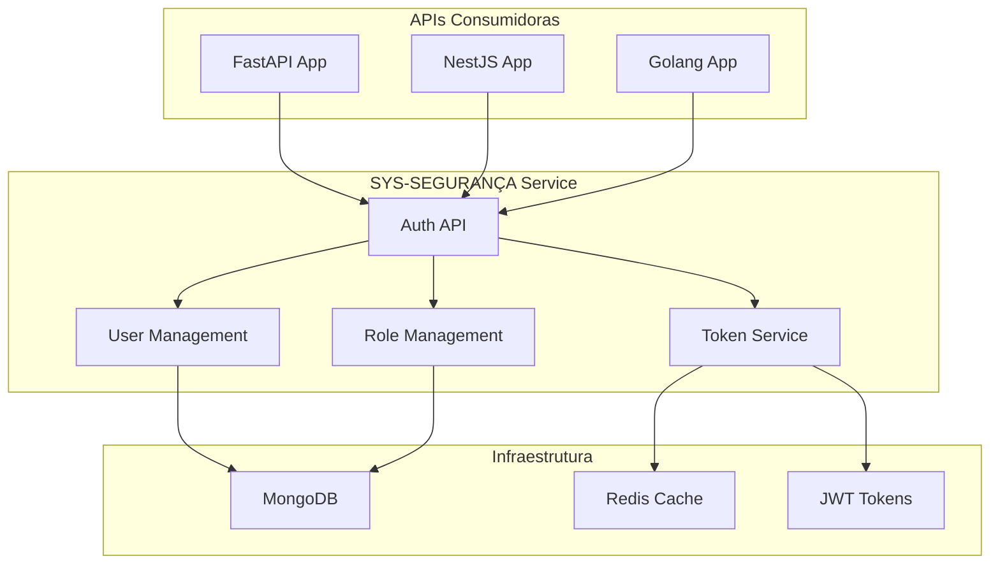
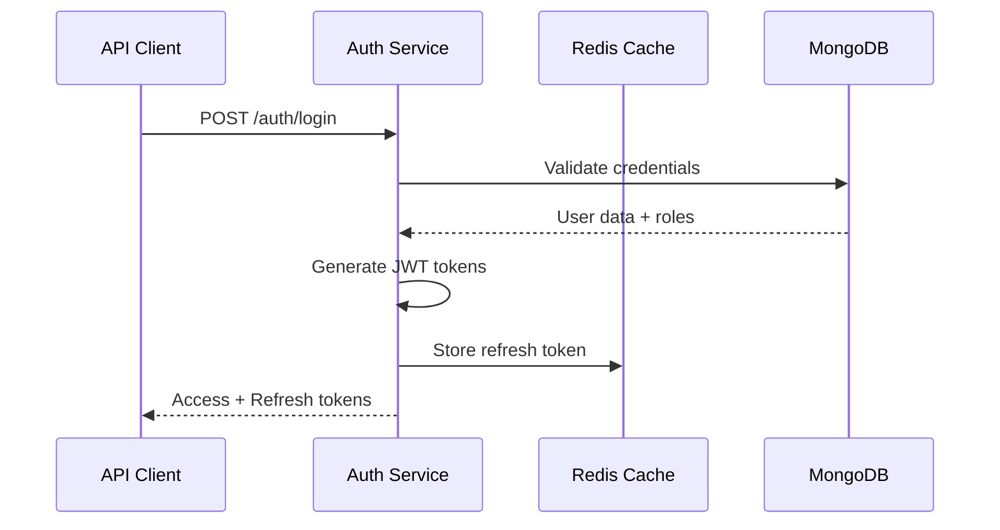
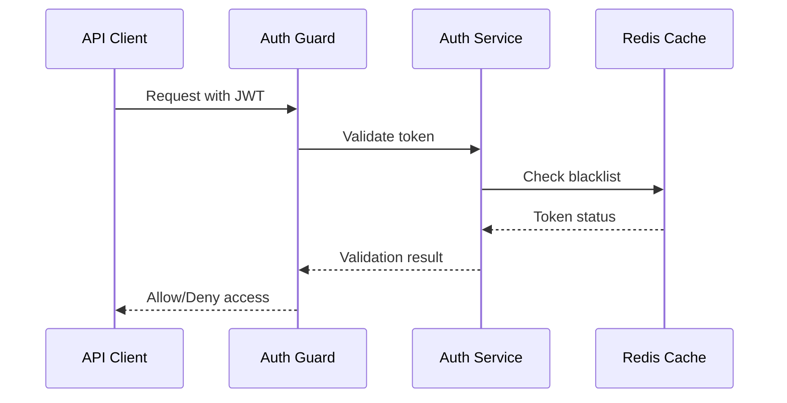

# 🛡️ SYS-SEGURANÇA - Arquitetura e Implementação

## 📋 Visão Geral

O **SYS-SEGURANÇA** é um serviço de autenticação e autorização centralizado que fornece tokens JWT para APIs consumidoras em diferentes linguagens de programação. O serviço é projetado para ser altamente escalável, seguro e fácil de integrar.

## 🎯 Objetivos

- ✅ **Centralizar autenticação** para todas as APIs do ecossistema
- ✅ **Fornecer client libraries** para Python, Node.js e Golang
- ✅ **Implementar RBAC** (Role-Based Access Control)
- ✅ **Suportar múltiplos tipos de tokens** (access, refresh, application)
- ✅ **Cache inteligente** com Redis para performance
- ✅ **Logs de auditoria** para compliance

## 🏗️ Arquitetura

### 5.1. Diagrama de Alto Nível



### 5.2. Componentes Principais

#### **Auth Module**
- **Login/Logout** de usuários
- **Refresh tokens** automático
- **Validação** de tokens
- **Rate limiting** por IP/usuário

#### **User Management**
- **CRUD** de usuários
- **Perfis** e configurações
- **Histórico** de atividades
- **Soft delete** para auditoria

#### **Role Management**
- **Hierarquia** de perfis
- **Permissões granulares** por recurso
- **Herança** de permissões
- **Auditoria** de mudanças

#### **Token Service**
- **Geração** de JWT tokens
- **Validação** e verificação
- **Blacklist** de tokens revogados
- **Expiração** automática

## 🔐 Fluxos de Autenticação

### 5.3. Login Flow



### 5.4. Token Validation Flow



## 🚀 Implementação

### 5.5. Estrutura de Diretórios

```
sys-seguranca-service/
├── src/
│   ├── modules/
│   │   ├── auth/
│   │   │   ├── controllers/
│   │   │   ├── services/
│   │   │   ├── guards/
│   │   │   └── dto/
│   │   ├── users/
│   │   ├── roles/
│   │   └── tokens/
│   ├── shared/
│   │   ├── guards/
│   │   ├── decorators/
│   │   ├── interceptors/
│   │   └── filters/
│   ├── config/
│   └── main.ts
├── client-libs/
│   ├── python/
│   ├── nodejs/
│   └── golang/
├── docker/
├── tests/
└── docs/
```

### 5.6. Configurações

#### **Environment Variables**
```bash
# Database
MONGODB_URI=mongodb://localhost:27017/sys-seguranca
REDIS_URL=redis://localhost:6379

# JWT
JWT_SECRET=your-super-secret-key
JWT_ACCESS_EXPIRES=15m
JWT_REFRESH_EXPIRES=7d

# Security
BCRYPT_ROUNDS=12
RATE_LIMIT_WINDOW=15m
RATE_LIMIT_MAX_REQUESTS=100

# API Keys
API_KEY_HEADER=X-API-Key
API_KEY_SECRET=your-api-key-secret
```

## 🔌 Integração com APIs

### 5.7. Python (FastAPI)

```python
from fastapi import FastAPI, Depends, HTTPException
from fastapi.security import HTTPBearer
from sys_seguranca_client import AuthClient, get_current_user

app = FastAPI()
auth_client = AuthClient(
    base_url="https://auth.systentando.com",
    api_key="your_api_key"
)

@app.get("/protected")
async def protected_route(current_user = Depends(get_current_user)):
    return {"message": f"Olá {current_user.username}!"}

@app.post("/login")
async def login(username: str, password: str):
    try:
        token = await auth_client.login(username, password)
        return {"access_token": token}
    except Exception as e:
        raise HTTPException(status_code=401, detail="Credenciais inválidas")
```

### 5.8. Node.js (NestJS)

```typescript
import { Module } from '@nestjs/common';
import { SysSegurancaModule } from '@systentando/sys-seguranca-client';

@Module({
  imports: [
    SysSegurancaModule.forRoot({
      baseUrl: 'https://auth.systentando.com',
      apiKey: 'your_api_key',
    }),
  ],
})
export class AppModule {}

// Controller
@Controller('api')
@UseGuards(SysSegurancaGuard)
export class ApiController {
  @Get('protected')
  @Roles('admin', 'user')
  async protectedRoute(@CurrentUser() user: User) {
    return { message: `Olá ${user.username}!` };
  }
}
```

### 5.9. Golang (Gin)

```go
package main

import (
    "github.com/gin-gonic/gin"
    "github.com/systentando/sys-seguranca-client"
)

func main() {
    r := gin.Default()
    
    // Middleware de autenticação
    auth := sysseguranca.NewAuthMiddleware(&sysseguranca.Config{
        BaseURL: "https://auth.systentando.com",
        APIKey:  "your_api_key",
    })
    
    // Rotas protegidas
    protected := r.Group("/api")
    protected.Use(auth.Authenticate())
    {
        protected.GET("/protected", func(c *gin.Context) {
            user := c.MustGet("user").(sysseguranca.User)
            c.JSON(200, gin.H{
                "message": "Olá " + user.Username + "!",
            })
        })
    }
    
    r.Run(":8080")
}
```

## 📊 Modelos de Dados

### 5.10. User Schema

```typescript
interface User {
  _id: ObjectId;
  username: string;
  email: string;
  passwordHash: string;
  roles: string[];
  profile: {
    firstName: string;
    lastName: string;
    avatar?: string;
    preferences: Record<string, any>;
  };
  status: 'active' | 'inactive' | 'suspended';
  lastLogin?: Date;
  createdAt: Date;
  updatedAt: Date;
}
```

### 5.11. Role Schema

```typescript
interface Role {
  _id: ObjectId;
  name: string;
  description: string;
  permissions: Permission[];
  inheritsFrom?: string[];
  isSystem: boolean;
  createdAt: Date;
  updatedAt: Date;
}

interface Permission {
  resource: string;
  actions: string[];
  conditions?: Record<string, any>;
}
```

### 5.12. Token Schema

```typescript
interface Token {
  _id: ObjectId;
  userId: ObjectId;
  type: 'access' | 'refresh' | 'application';
  token: string;
  expiresAt: Date;
  isRevoked: boolean;
  metadata: {
    ip: string;
    userAgent: string;
    deviceId?: string;
  };
  createdAt: Date;
}
```

## 🔒 Segurança

### 5.13. Medidas de Segurança

- **JWT com expiração curta** (15min para access, 7 dias para refresh)
- **Rate limiting** por IP e usuário
- **Validação de IP** para tokens sensíveis
- **Auditoria completa** de todas as operações
- **Criptografia** de senhas com bcrypt
- **Blacklist** de tokens revogados
- **Validação de API keys** para serviços

### 5.14. Compliance

- **GDPR compliance** com direito ao esquecimento
- **Audit logs** para auditorias externas
- **Data retention** configurável
- **Encryption at rest** para dados sensíveis

## 📈 Performance e Escalabilidade

### 5.15. Estratégias de Cache

- **Redis** para tokens ativos
- **Cache de usuários** com TTL configurável
- **Cache de permissões** por role
- **Invalidation** automática em mudanças

### 5.16. Monitoramento

- **Métricas** de performance
- **Logs estruturados** em JSON
- **Alertas** para falhas de autenticação
- **Dashboard** de saúde do serviço

## 🧪 Testes

### 5.17. Estratégia de Testes

- **Unit tests** para todos os serviços
- **Integration tests** para APIs
- **E2E tests** para fluxos completos
- **Load tests** para performance
- **Security tests** para vulnerabilidades

## 🚀 Deploy e DevOps

### 5.18. Docker

```dockerfile
FROM node:18-alpine

WORKDIR /app
COPY package*.json ./
RUN npm ci --only=production

COPY dist ./dist
COPY node_modules ./node_modules

EXPOSE 3000
CMD ["node", "dist/main"]
```

### 5.19. Kubernetes

```yaml
apiVersion: apps/v1
kind: Deployment
metadata:
  name: sys-seguranca
spec:
  replicas: 3
  selector:
    matchLabels:
      app: sys-seguranca
  template:
    metadata:
      labels:
        app: sys-seguranca
    spec:
      containers:
      - name: sys-seguranca
        image: systentando/sys-seguranca:latest
        ports:
        - containerPort: 3000
        env:
        - name: NODE_ENV
          value: "production"
```

## 📚 Próximos Passos

1. **Criar repositório privado** para o serviço
2. **Implementar MVP** com autenticação básica
3. **Desenvolver client libraries** para cada linguagem
4. **Testes e documentação** completos
5. **Deploy em produção** com monitoramento
6. **Migração gradual** das APIs existentes

## 🔗 Links Úteis

- [JWT.io](https://jwt.io/) - Documentação JWT
- [Redis](https://redis.io/) - Cache in-memory
- [MongoDB](https://www.mongodb.com/) - Banco de dados
- [NestJS](https://nestjs.com/) - Framework Node.js
- [FastAPI](https://fastapi.tiangolo.com/) - Framework Python
- [Gin](https://gin-gonic.com/) - Framework Golang
